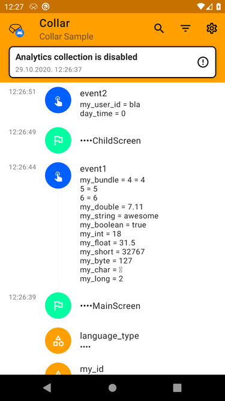
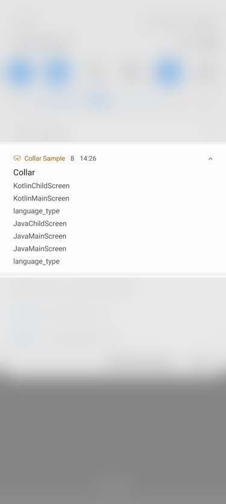

  

### 
# Collar Android plugin

Gradle plugin which collects all analytics screen names, events and user properties for Android projects.  
This plugin has been written in Kotlin but works both inside Kotlin and Java projects.

**IMPORTANT:** Collar does **NOT** send out analytics data to remote services. This is left for the developer to solve in their own codebase, with Collar being simply a reflection of the current state of analytics data.

The project is organized in the following modules:

- `annotations` - contains all annotations necessary for the plugin to work
- `core` - plugin implementation core, depends on the `annotations` module
- `processor` - annotation processor generating and transforming classes for plugin, depends on the `annotations` module
- `plugin` - the Gradle plugin that adds all necessary dependencies to the project
- `ui` - contains a single screen UI that provides visual tracking of sent events
- `ui-no-op` - contains a stub for easy release implementation of UI package
- `generator` - contains a generator code for provided tracking plan
- `sample` - a sample app for testing the Gradle plugin

## Usage

To include plugin to your project, you have to add buildscript dependencies in your project level `build.gradle` or `build.gradle.kts`:

**Groovy**
```gradle
buildscript {
    repositories {
        mavenCentral()
    }
    dependencies {
        classpath "com.infinum.collar:collar-plugin:1.2.7"
    }
}
```
**KotlinDSL**
```kotlin
buildscript {
    repositories {
        mavenCentral()
    }
    dependencies {
        classpath("com.infinum.collar:collar-plugin:1.2.7")
    }
}
```

Then apply the plugin in your app `build.gradle` or `build.gradle.kts` :

**Groovy**
```gradle
apply plugin: "com.infinum.collar.plugin"
```
**KotlinDSL**
```kotlin
plugins {
    ...
    
    id("com.infinum.collar.plugin")
}
```

Now you can sync your project.


### Getting started

Create or inject an instance of _Collar_ in your Application class and attach a _Collector_:


```kotlin
Collar.attach(object : Collector {
  
    override fun onScreen(screen: Screen) =
        analyticsProvider.sendScreenName(screenName = screen.name)

    override fun onEvent(event: Event) =
        analyticsProvider.sendEvent(eventName = event.name, eventParameters = event.params ?: Bundle.EMPTY)

    override fun onProperty(property: Property) =
        analyticsProvider.sendProperty(property.name, property.value)
})
```

_analyticsProvider_ is your own implementation of an analytics delegate class.

#### Screen names

Screen names can be annotated on top of **Activities** or **Fragments**. No other views are eligible as screen name destination holders.


```kotlin
@ScreenName(AnalyticsKeys.ScreenName.BRAND_DETAILS)
class BrandFragment : Fragment(R.layout.fragment_brand) {

    ...

    override fun onResume() = super.onResume().run { trackScreen() }

}
```

Actual screen name annotation values are maintained and provided per project implementing this plugin.  
If a screen name annotation value is not provided then class name will be used as annotation value.  
A convenience extension method will be generated by annotation processor _trackScreen_ which must be called explicitly and preferably in _onResume_ lifecycle callback.  
However, you can always use _Collar_ methods explicitly besides the extension one to track your screen names.
```kotlin
    Collar.trackScreen(screen)
```

#### Events

Create a model container **sealed** class with arbitrary name where you see fit in your project and annotate as illustrated below.  
Nested classes represent the events you want to track.   
Class name will be processed into lowercase snake_case appropriate for most analytics dependencies, as well as the containing variable names.  
Variable values will be propagated as event parameter values.  
You can override event name for specific nested class then use _EventName_ annotation with a respective new event name.  
Accordingly, you can override event parameter name using _EventParameterName_ annotation too.


```kotlin
@AnalyticsEvents
sealed class AnalyticsEvent {

    data class LanguageSelection(
        val selectedLanguage: String,
        val exhibitorCount: Int
    ) : AnalyticsEvent()
    
    class Login : AnalyticsEvent()
    
    @EventName("login_guest")
    class Guest : AnalyticsEvent()
    
    data class ShortcutLink(
        @EventParameterName("URL")
        val url: String
    ) : AnalyticsEvent()
}
```
You can have multiple annotated sealed classes declared like this through your project.  
A convenience extension method will be generated by annotation processor _trackEvent_ which must be called explicitly with the instance of your previously defined event class.  
However, you can always use _Collar_ methods explicitly besides the extension one to track your analytics events in the same way.
```kotlin
    Collar.trackEvent(event)
```

```kotlin
@ScreenName(AnalyticsKeys.ScreenName.BRAND_DETAILS)
class BrandFragment : Fragment(R.layout.fragment_brand) {

    ...

    override fun onResume() = super.onResume().run { trackScreen() }
    
    ...
    
    private fun onFavor(exhibitor: Exhibitor) {
        viewModel.favor(exhibitor)
        
        ...
        
        trackEvent(AnalyticsEvent.ExhibitorFavored(exhibitorId = exhibitor.id, exhibitorName = exhibitor.name))
    }

}
```
#### Properties

Create a model container **sealed** class with arbitrary name where you see fit in your project and annotate as illustrated below.  
Nested classes represent the user properties you want to track.   
Class name will be processed into lowercase snake_case appropriate for most analytics dependencies, as well as the containing variable names.  
Variable value will be propagated as user property value.  
You can override user property name for specific nested class then use _PropertyName_ annotation with a respective new property name.  
A property nested class can have only 1 declared variable as value. 


```kotlin
@UserProperties
sealed class UserProperty {

    @PropertyName(value = "user_type_corporate")
    data class UserType1(
        val value: String
    ) : UserProperty()
    
    data class UserTypeRetail(
        val someCoolValue: String
    ) : UserProperty()
}
```
You can have multiple annotated sealed classes declared like this through your project.  
A convenience extension method will be generated by annotation processor _trackProperty_ which must be called explicitly with the instance of your previously defined property class.  
However, you can always use _Collar_ methods explicitly besides the extension one to track your user properties in the same way.
```kotlin
    Collar.trackProperty(property)
```

```kotlin
@ScreenName(AnalyticsKeys.ScreenName.BRAND_DETAILS)
class BrandFragment : Fragment(R.layout.fragment_brand) {
    
    ...

    override fun onCreate() = super.onCreate().run {
        trackProperty(UserProperty.UserTypeRetail("retail"))
    }

    ...

    override fun onResume() = super.onResume().run { trackScreen() }
    
    ...
    
    private fun onFavor(exhibitor: Exhibitor) {
        viewModel.favor(exhibitor)
        
        ...
        
        trackEvent(AnalyticsEvent.ExhibitorFavored(exhibitorId = exhibitor.id, exhibitorName = exhibitor.name))
    }

}
```
## Options

### Annotation processor

_Collar_ plugin has been tuned per default for the most often used Firebase Analytics but additional options can be passed to annotation processor for fine tuning:

```gradle
javaCompileOptions {
    annotationProcessorOptions {
        argument "screen_name_length", "33"
        argument "events_count", "100"
        argument "event_parameters_count", "10"
        argument "event_name_length", "20"
        argument "properties_count", "17"
        argument "reserved_prefixes", "ga_,fb_"
        argument "reserved_properties", "Age,Country"
    }
}
```

## Debug UI



A separate _ui_ and _ui-no-op_ packages are provided if you want to visually track what has been sent through Collar.  
You can search, filter and clear all sent analytics.  

In your app `build.gradle` or `build.gradle.kts` add:  
**Groovy**
```gradle
debugImplementation "com.infinum.collar:collar-ui:1.2.7"
releaseImplementation "com.infinum.collar:collar-ui-no-op:1.2.7"
```
**KotlinDSL**
```kotlin
debugImplementation("com.infinum.collar:collar-ui:1.2.7")
releaseImplementation("com.infinum.collar:collar-ui-no-op:1.2.7")
```

In order to start tracking with UI you must use _LiveCollector_ as in this example:
```kotlin
val configuration = Configuration(
  analyticsCollectionEnabled = true, 
  showSystemNotifications = true, 
  showInAppNotifications = true, 
  redactedKeywords = redactedWords
)
Collar.attach(object : LiveCollector(configuration) {
   
    override fun onScreen(screen: Screen) =
        super.onScreen(screen).run {
            analyticsProvider.sendScreenName(screenName = screen.name)
        }

    override fun onEvent(event: Event) =
        super.onEvent(event).run {
            analyticsProvider.sendEvent(eventName = event.name, eventParameters = event.params ?: Bundle.EMPTY)
        }

    override fun onProperty(property: Property) =
        super.onProperty(property).run {
            analyticsProvider.sendProperty(property.name, property.value)
        }
})
```
_LiveCollector_ constructor has a _Configuration_ parameter that consists of the following members. 
The first parameter (*setAnalyticsCollectionEnabled*) defines the default state of analytics collection. If set to *false*, a warning message will appear in the Collar UI.
If you set the second parameter (*showSystemNotification*) as *true*, a notification will show once analytics are gathered and clicking on it will open a dedicated screen.  
The third parameter (*showInAppNotification*) with value *true* will show a Snackbar-ish popup once analytics are gathered inside the currently running Activity.  
These parameters are default values per collector session but can be changed via _CollarActivity_ menu and will remain valid until the next session.  
Otherwise if set to *false* notification will **not** be shown but you can always run the UI with following command of getting the launch Intent instead of clicking the actual notification:

```kotlin
    startActivity(
        CollarUi.launchIntent().apply {
            addFlags(Intent.FLAG_ACTIVITY_SINGLE_TOP)
        }
    )
```
Alternatively, you can use a dedicated method with default Intent setup:
```kotlin
    CollarUi.show()
```
The final *Configuration* parameter is a set of keywords to redact if found in screen names, analytics events names and parameters and user properties names or values.

 

### Redaction
In order to prevent potential leaks of user sensitive data, developers have an option to implement a set of keywords to be replaced by a • in length of the matched keyword.  
This set of keywords is provided to _LiveCollector_ via _Configuration_.  


## Tasks
### Generate

Gradle plugin supports code generation from a JSON formatted file.  
You will need to specify `fileName` and `packageName` in  `collar` plugin extension.  
For example:

```
collar {
    fileName = "example.json"
    packageName = "com.infinum.collar.sample.analytics.generated"
}
```
JSON file has to be formatted in the same way as it is in `sample` project module.  
If you don't want to use this task simply don't specify data parameters in plugin extension.  
Using this file is just a temporary solution and fetching the tracking plan will be implemented soon in future releases.

To run the task you can:

- Open `gradle` panel on right side, find `collar` task group and run `generate` task 
- Type `./gradlew generate` in terminal

`generate` Gradle task will create classes prepared for the _Collar_ annotation processor.

## Contributing

Feedback and code contributions are very much welcome. Just make a pull request with a short description of your changes. By making contributions to this project you give permission for your code to be used under the same [license](LICENSE).  
For easier developing a `sample` application with proper implementations is provided.  
It is also recommended to uncomment the block of dependency substitution in project level `build.gradle`.

## License

```
Copyright 2020 Infinum

Licensed under the Apache License, Version 2.0 (the "License");
you may not use this file except in compliance with the License.
You may obtain a copy of the License at

   http://www.apache.org/licenses/LICENSE-2.0

Unless required by applicable law or agreed to in writing, software
distributed under the License is distributed on an "AS IS" BASIS,
WITHOUT WARRANTIES OR CONDITIONS OF ANY KIND, either express or implied.
See the License for the specific language governing permissions and
limitations under the License.
```

## Credits

Maintained and sponsored by [Infinum](http://www.infinum.com).

<a href='https://infinum.co'>
  
</a>
